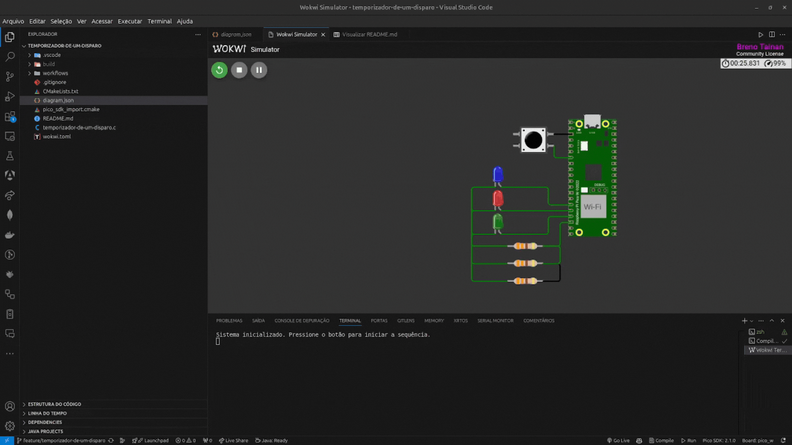

# ⏱️ Temporizador de Um Disparo (One Shot) – Raspberry Pi Pico W

Este projeto implementa um **sistema de temporização One Shot** utilizando o **Raspberry Pi Pico W** e a biblioteca **Pico SDK**. O sistema aciona três LEDs (azul, vermelho e verde) **com base no clique de um botão** (pushbutton), desligando-os sequencialmente com um intervalo de 3 segundos entre cada estado.

## 🎬 Demonstração do Funcionamento



---

## 📂 **Estrutura do Projeto**
```bash
temporizador-de-um-disparo/
│── build/                     # Diretório gerado após a compilação
│── CMakeLists.txt             # Configuração do CMake para compilação do projeto
│── diagram.json               # Arquivo de diagrama da simulação no Wokwi
│── pico_sdk_import.cmake      # Importação do SDK do Raspberry Pi Pico
│── README.md                  # Documentação do projeto
│── temporizador-de-um-disparo.c  # Código-fonte principal
│── wokwi.toml                 # Configuração da simulação no Wokwi
│── workflows/                 # Diretório para automação e integração contínua
│── gif/                       # Pasta contendo o GIF da demonstração
│   └── oneshot.gif            # Arquivo de demonstração animada
```

---

## 🎯 **Objetivos do Projeto**
✅ Acionar **três LEDs** (azul, vermelho e verde) ao pressionar um **botão**  
✅ Implementar um **temporizador de um disparo** usando `add_alarm_in_ms()`  
✅ Desligar os LEDs **um por um na ordem Azul → Vermelho → Verde**, com um atraso de **3 segundos** entre cada mudança  
✅ **Evitar múltiplas ativações** enquanto a sequência de desligamento estiver em execução  
✅ Implementar **debounce por software** para evitar múltiplas detecções falsas do botão  

---

## 🛠 **Componentes e Conexões**
| **Componente**  | **Pino GPIO** |
|----------------|-------------|
| 🔵 LED Azul    | GPIO 11 |
| 🔴 LED Vermelho | GPIO 12 |
| 🟢 LED Verde   | GPIO 13 |
| 🎛️ Botão (Pushbutton) | GPIO 5 |

📌 **Nota:** Os LEDs devem ser conectados em série com **resistores de 330Ω** para limitar a corrente.

---

## 🚀 **Como Clonar e Rodar o Projeto**
### 📌 **Passo 1: Clonar o Repositório**
Abra um terminal e execute o seguinte comando:
```bash
git clone https://github.com/brenotainandev/temporizador-de-um-disparo.git
cd temporizador-de-um-disparo
```

### 📌 **Passo 2: Configurar o Ambiente**
1. **Instale o SDK do Raspberry Pi Pico** seguindo a documentação oficial:  
   🔗 [Guia Oficial do Pico SDK](https://github.com/raspberrypi/pico-sdk)  
2. **Configure seu ambiente** para compilar programas em C para o Raspberry Pi Pico.

### 📌 **Passo 3: Compilar o Código**
Execute os seguintes comandos para compilar e gerar o binário `.uf2`:
```bash
mkdir build
cd build
cmake ..
make
```

### 📌 **Passo 4: Enviar para o Raspberry Pi Pico**
1. Conecte o **Raspberry Pi Pico W** ao computador segurando o botão **BOOTSEL**.  
2. Monte a unidade de armazenamento USB chamada **RPI-RP2**.  
3. Arraste o arquivo `.uf2` gerado no diretório `build/` para a unidade **RPI-RP2**.  

---

## 📡 **Saída Esperada no Terminal Serial**
Se conectado via **UART/USB**, o código imprimirá algo como:
```
Sistema inicializado. Pressione o botão para iniciar a sequência.
Botão pressionado! Iniciando sequência dos LEDs...
LED azul desligado.
LED vermelho desligado.
LED verde desligado. Sequência finalizada.
```
Isso indica que **o sistema está funcionando corretamente!** 🎯

---

## 📝 **Explicação do Código**
1. **Inicializa os LEDs e botão**, configurando os **GPIOs** apropriados.  
2. **Habilita a interrupção do botão**, permitindo detectar cliques sem ocupar o loop principal.  
3. Ao pressionar o botão:
   - Todos os LEDs são **ligados**.
   - Um **temporizador (3s)** desliga o **LED azul**.
   - Após mais **3s**, desliga o **LED vermelho**.
   - Após mais **3s**, desliga o **LED verde** e **libera o botão para uma nova ativação**.  
4. **Debounce por software** impede múltiplas ativações indesejadas do botão.  

---

## 🔗 **Referências**
- 📖 [Raspberry Pi Pico SDK Documentation](https://datasheets.raspberrypi.com/pico/raspberry-pi-pico-c-sdk.pdf)

🚀 **Agora é só testar e rodar seu temporizador One Shot no Raspberry Pi Pico W!** 🎉